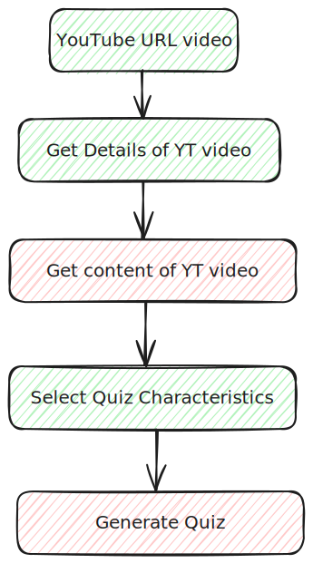

# quizzer

## Main idea

Generate a quiz from the content of YouTube video.

## Requirements

### Functional Requirements:

- Creation of a Quiz
- Solve Quiz
- Share Quiz
- Export Quiz (pdf, word)

### Non-functional Requirements:

- `currently PoC`

## Tech Stack

- **Backend:** Python:
  - YouTube - get the content of YT video
  - NLP (Keywords Extraction): TF-Idf, Rake
  - HuggingFace: transcript summarization
  - OpenAI (ChatGPT-4o-mini)
  - _(Ollama (DeepSeek))_
- **Frontend:** Streamlit
- **Persistence:** MongoDB Atlas

## Details

- URL of YouTube video
- Paste it into a GUI
- Select the details of quiz (question types, number of questions)
- Quiz is generated

## More Detailed Details

- URL of YouTube video:
  - You can paste:
    - The whole URL or
    - only the last part (video_id)
- Paste it into a GUI:
  - Once you paste URL/video_id, engine will get details of this video:
    - Title
    - Author
    - Length
    - Thumbnail
    - Keywords
    - etc...
- Select the details of quiz (question types, number of questions):
  -Quiz Name
  - Types of Answers:
    - One-choice questions
    - Multiple-choice questions
    - Free text
    - ...
  - Number of Questions
  - Key Topics
- Quiz is generated
  - Store in a persistence layer
  - Quiz can be solved online
  - Quiz can be shared with other people
  - Quiz can be downloaded (PDF, word, JSON)

## Main points

- YouTube Content Download:
  - Some videos have a transcript, some not
  - Transcript can be a human-prepared or machine-prepared transcripts
  - Quality of machine-prepared transcripts?
  - When transcript does not exist:
    - Extract audio from the video, then convert to text (**Speech2Text**)
- Keywords for Quiz:
  - These are main topics of the video that will be used to guide Quiz Generator on what topics generate Quiz
  - Some YT videos have keywords provided (by authors)
  - Sometimes there is acceptable number of keywords (3-4), sometimes a lot (40 for 2 minutes movie)
  - Solution: A combination of YT video keywords extraction and NLP-extracted keywords
- Keywords generation:
  - Usage of NLP techniques: **TF-Idf**, **Rake**
  - Possibly use of other techniques based on **BERT**, etc...
  - TF-Idf and Rake can return different sets of words (TF-Idf returns words, Rake sentences)
  - TOP X words, but there are many words after TOP X with the same "importance" weights:
  - for each: similarity validation with each of the TOP X words
- Quiz generation:
  - Usage of **LLMs** with appropriate **Prompt**
